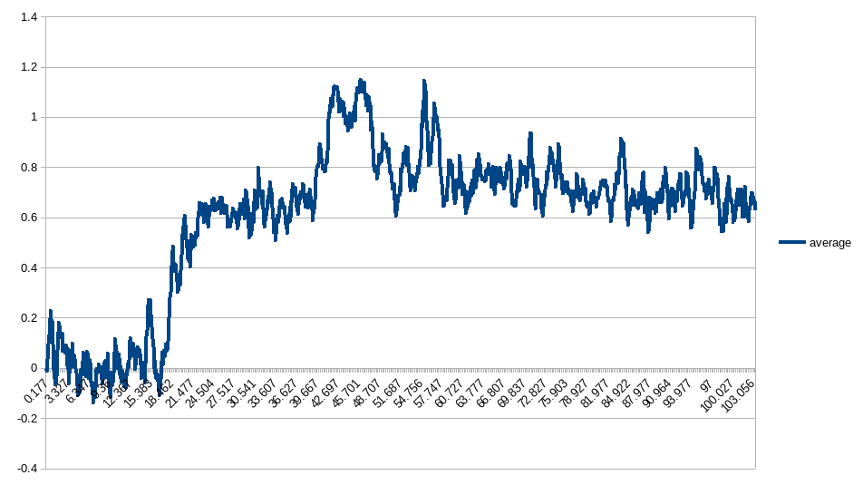

# Python Ammeter Logger
Works in conjunction with the [Micropython ADC Amperage Monitor](https://github.com/LearningToPi/adc_amerage)

View the details of our load testing series here: https://www.learningtopi.com/category/load-testing/

## Introduction
This Python module works with the [Micropython ADC Amperage Monitor](https://github.com/LearningToPi/adc_amerage) to collect data from a amperage monitor. The module will control the micropython microcontroller to run a baseline of the current sensor or collect data.

The module can be run of the command line or imported into other projects to record amperage data.

## CLI Usage

    (venv) $ python3 -m ammeter_logger 
    usage: __main__.py [-h] [--get-config] [--get-status] [--skip-init] [--force-init] [--init-only] [--sample-interval SAMPLE_INTERVAL] [--capture-time CAPTURE_TIME] [--baudrate BAUDRATE] [--log-level LOG_LEVEL]
                   DEVICE OUTPUT_FILE
    __main__.py: error: the following arguments are required: DEVICE, OUTPUT_FILE
    (venv) $ 

The --get-config and --get-status parameters can be used to get the current status of the microcontroller.

It is recommended to run the following the initialize the ammeter (get a baseline 0 reading) with no load on the ammeter before connecting the device you intend to monitor.  Initialization can be run using the --force-init option.

After the ammeter is initialized, the capture can be started using the --capture-time interval. Logged data will be stored in the specified output_file (as a CSV).

